# Fake Passport Detector


This is a project made by [Praneet Singh Sehra](https://github.com/pspraneetsehra08).
Database used is PostgreSQL, the fake passport report images are stored on [cloudinary](https://cloudinary.com/), the passport details are stored on Goerli test network with the profile image and signature image being stored on ipfs which is deployed using the api provided by [web3.storage](https://web3.storage/). The fake passport analysis graphs are generated using [Highcharts](https://www.highcharts.com/).  

- Built using Django and storing passport details on the blockchain
- Includes graphs to help analyze and track fake passport reports over time and in various geographical locations

## Three main authorities: 
- Passport issuing authority 
- Passport verifying authority
- Security officials present at the airports

## Flow:
- Passport issuing authority creates and edits passports and has access to fake passport analysis
- Passport verifying authority enters passport number and checks if physical passport is legitimate
- Security officials of specific airport where fake passport has been reported are alerted by email

This web app is a valuable tool for governments and organizations that need to verify the authenticity of passports. It is easy to use and provides a number of features that make it more effective than traditional methods of passport verification. The app's use of blockchain technology makes it tamper-proof and secure, and the graphs it generates provide valuable insights into the trends of fake passport reports. This app is a valuable addition to any organization's security toolkit.

## Tech Used

- Ethereum Blockchain
- Solidity
- Infura
- Web3.py
- Ipfs
- Web3.storage
- Django
- Python
- PostgreSQL
- Cloudinary
- Javascript
- Highcharts
- Bootstrap5
- Font Awesome

## Architecture

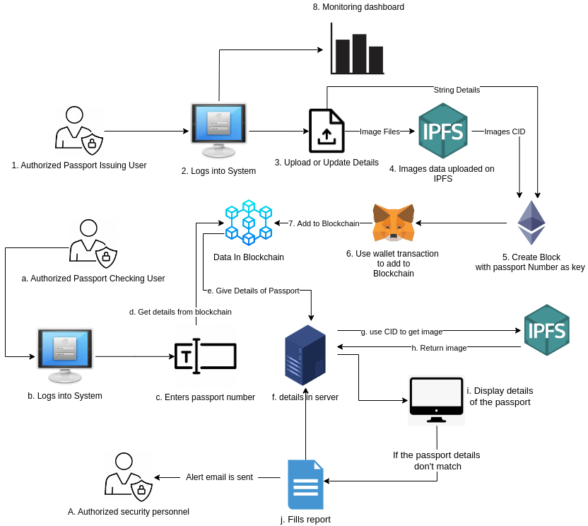

## Running this project

1. Clone the repository.
2. Create the env file using the env-sample file.
3. Run the following command from the root of the project.

```bash
pip install -r requirements.txt
```

```bash
py manage.py makemigrations
```

```bash
py manage.py migrate
```

4. Create a super user to access django admin panel (For creating issuer, verifier and security users)

```bash
py manage.py createsuperuser
```

5. Run the server

```bash
py manage.py runserver
```

> **NOTE:** You can also create a virtual environment, activate it and follow the above steps.

## Images

### Desktop

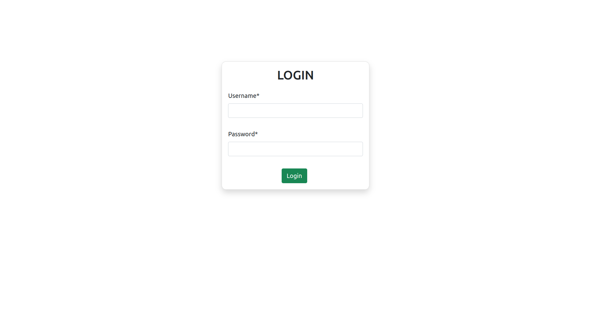
---

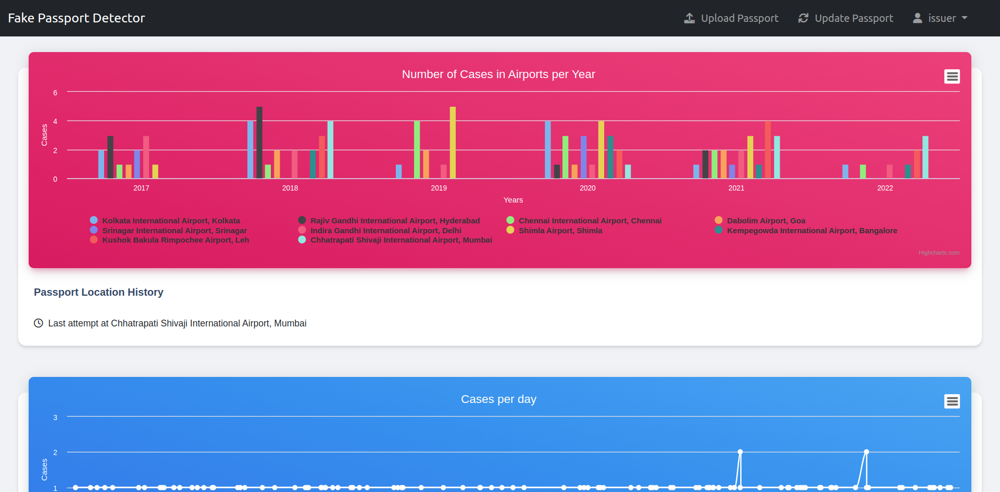
---

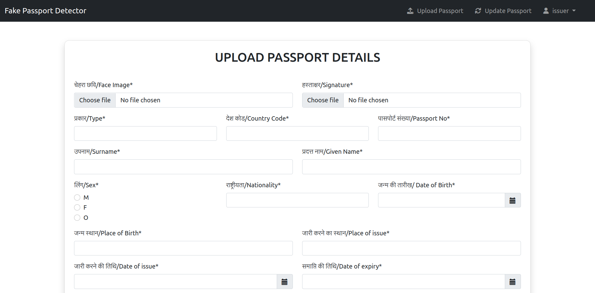
---

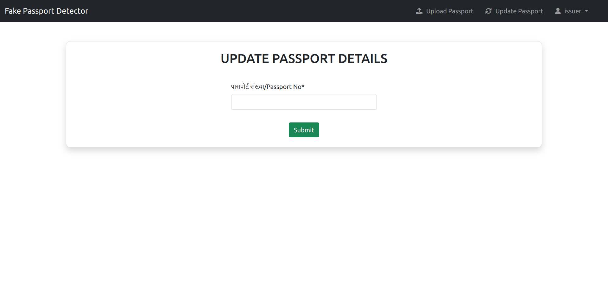
---

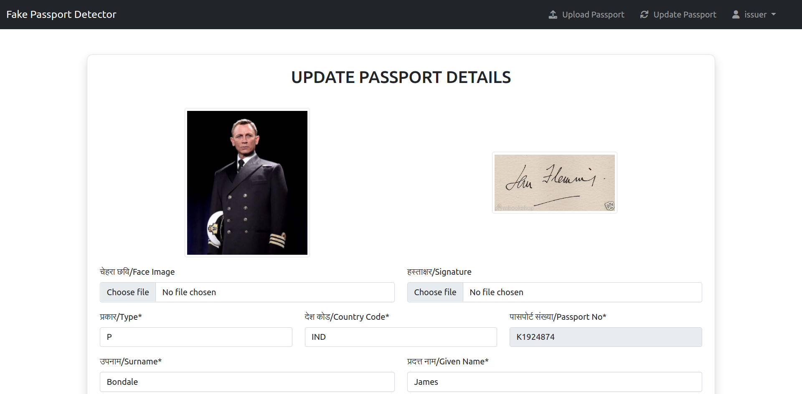
---

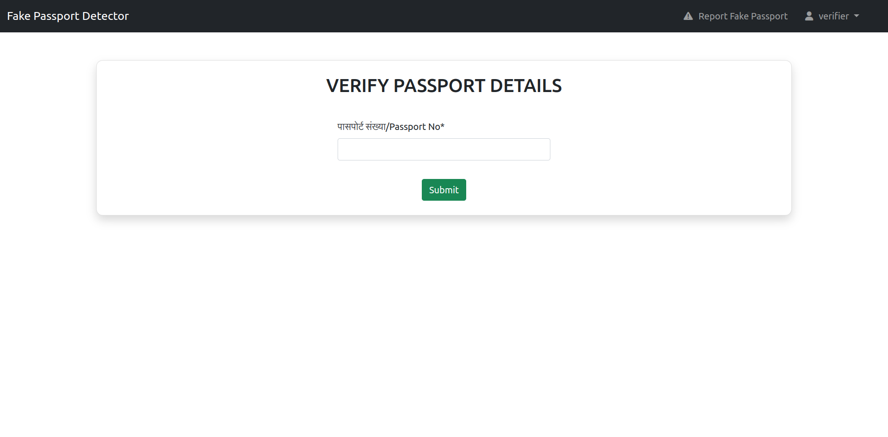
---

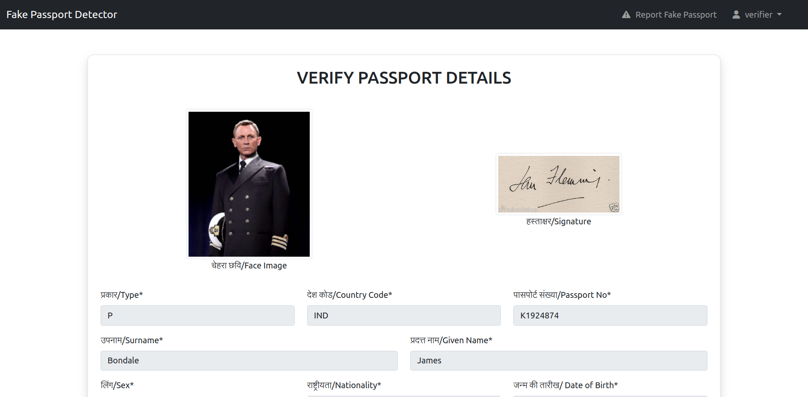
---

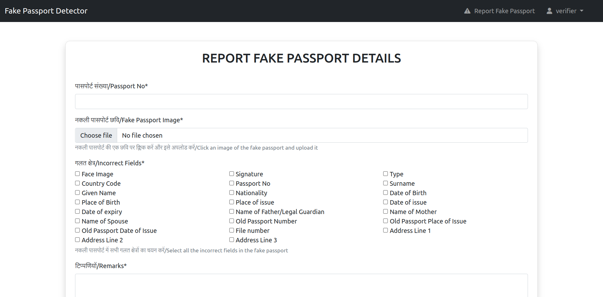
---

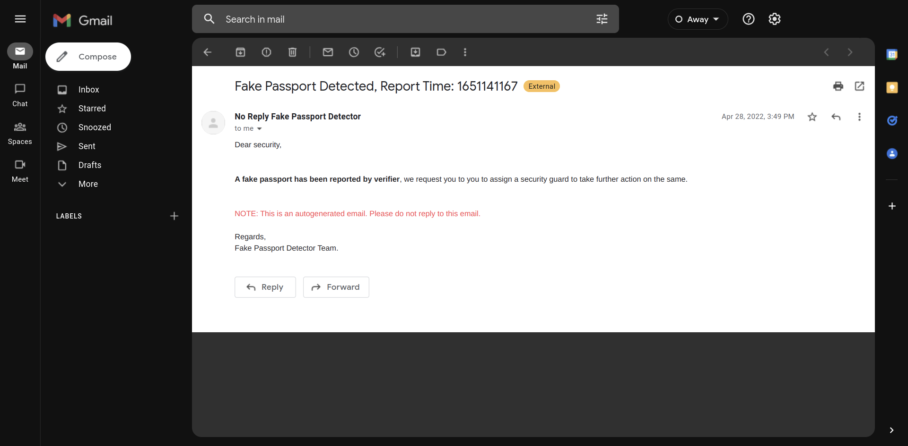

### Mobile Devices

|  | 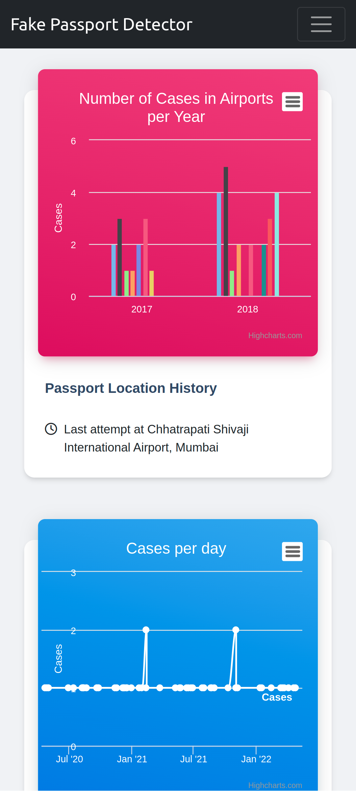 | 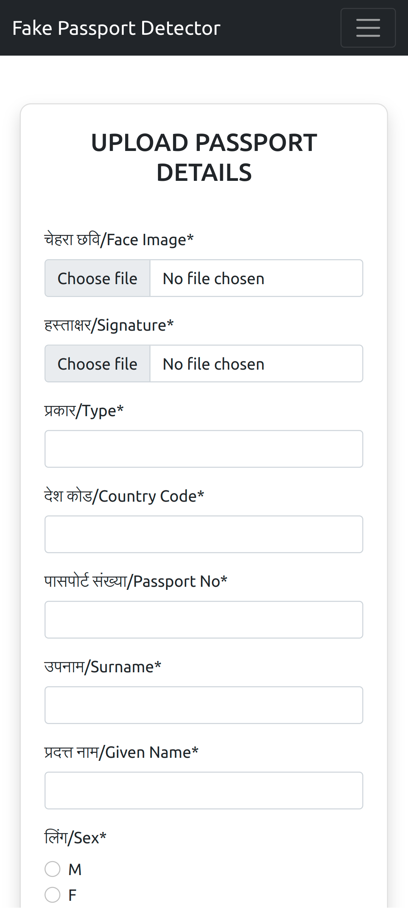 | 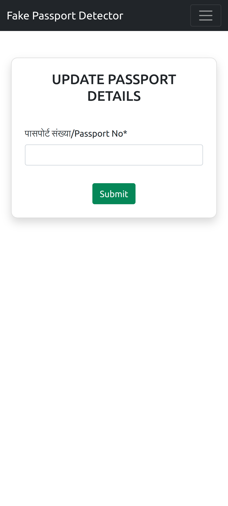 |
|---|---|---|---|
| 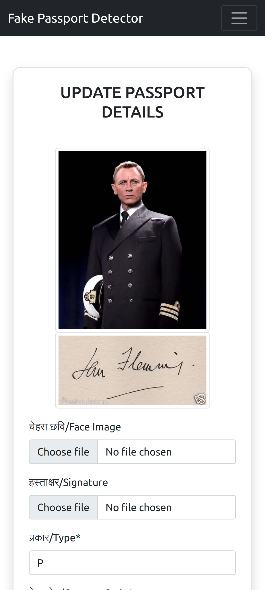 | 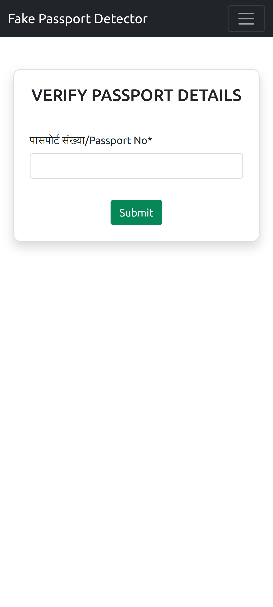 | 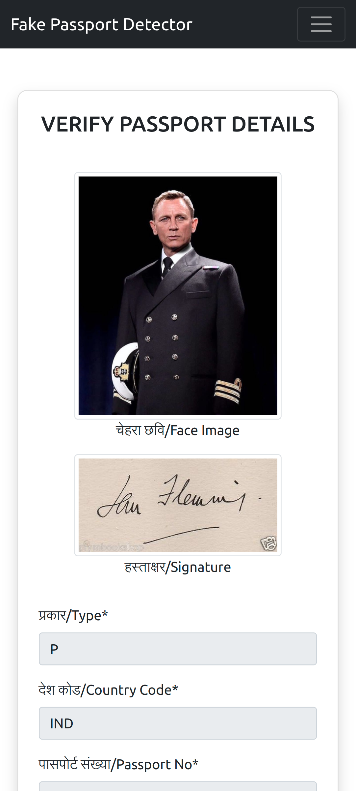 | 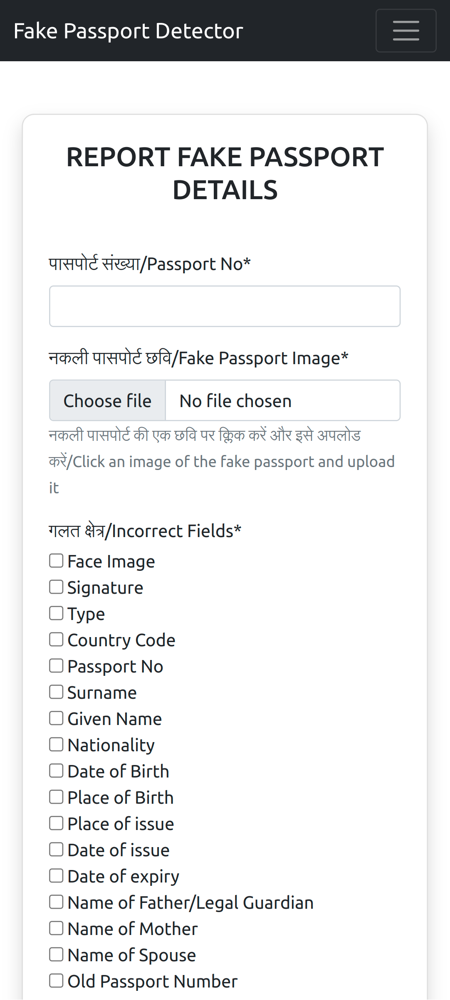 |  
